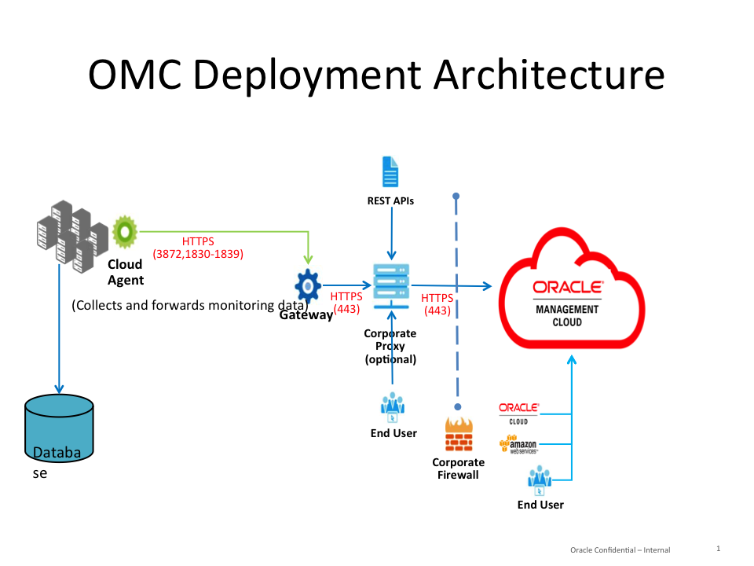

# OMC Deployment pre-requsites

Here is the recommended deployment architecture for OMC

## Gateway Requirements

Gateway is an optional component. However, Oracle recommends using a Gateway agent to limit access to internet. OMC gateway and agents use pull mechanism for all requests direct or via proxy

- Recommended Sizing for the server running Gateway
	- Memory:  8g RAM, 1g heap, Disk:  50g for small (< 100 entities), 100g+ for more
	- Up to 2000 agents to one gateway, or can use multiple for HA
	- Recommend standalone vm or host to isolate network and activity

## Cloud Agent Requirements

Need to be deployed on all hosts or VMs to collect metric or log data

- Install on a separate file system or mountpoint to avoid conflict with other products

- Memory: 4g RAM, .5g Heap; Disk: 10g for agent install

- Installation user
	- must have read access to files required for Log Analytics
	- set hard nofile 65536; max user processes >=4000

## Network Requirements

#### When using Gateway

- From Gateway to [OMC instance](https://<tenanid>.itom.management.us2.oraclecloud.com/*): permit outbound communication over (https/443) - directly or via proxy
	- IP address of the OMC instance can be determined by looking up hostname from the administraJon page of OMC console (Administration -> Agents ->Download Tab) and then simple OS level command such as nslookup to find the IP address associated with the hostname of the OMC instance. 

- Cloud Agent to Gateway: permit outbound communication over https/(3872,1830-1839)
	- These ports need to be opened only internally and not towards public internet

#### Without Gateway

- Cloud agent host to [OMC instance](https://<tenanid>.itom.management.us2.oraclecloud.com/*): permit outbound communication over (https/443) - directly or via proxy

	- IP address of the OMC instance can be determined by looking up hostname from the administraJon page of OMC console (Administration -> Agents ->Download Tab) and then simple OS level command such as nslookup to find the IP address associated with the hostname of the OMC instance. 

#### Optional proxy requirements
Host, port, authentication if required
